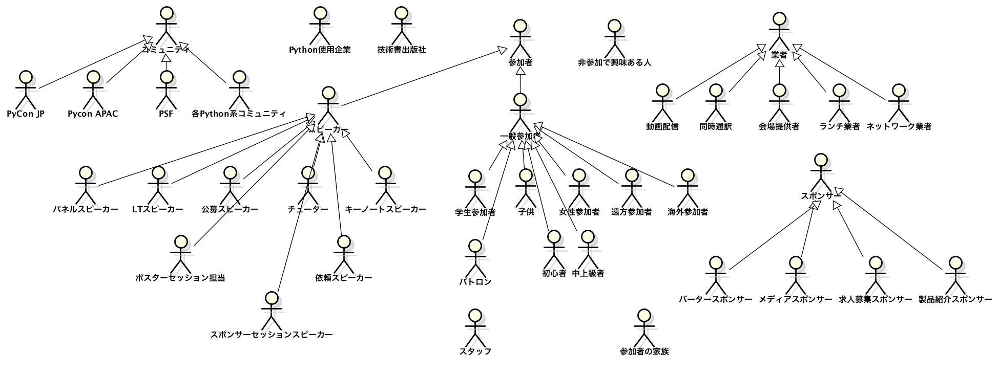
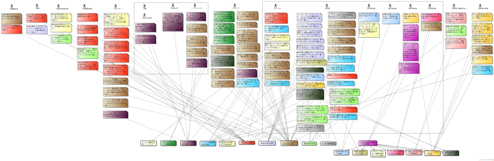
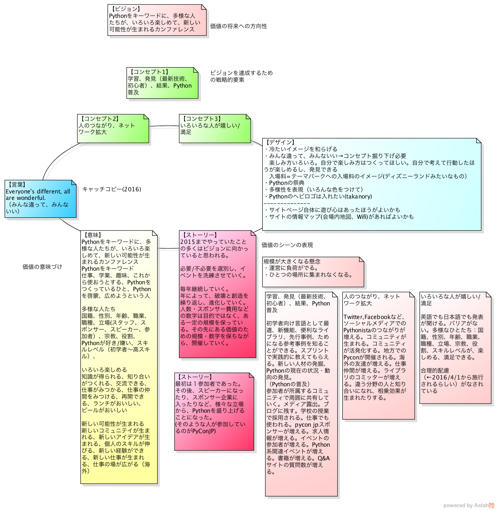
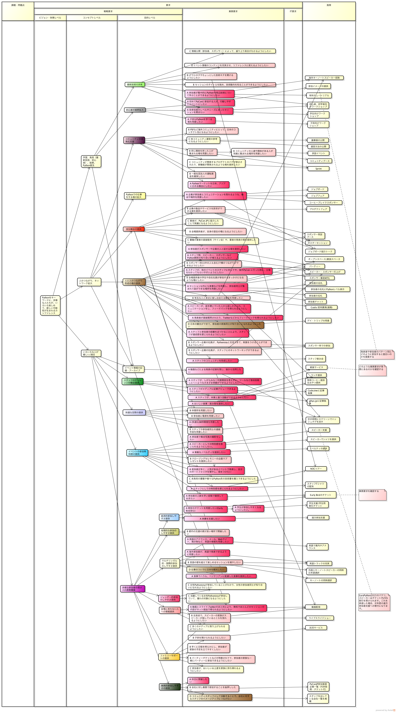

.. _policy:

========================
 イベント方針をまとめる
========================

ここではイベント方針のまとめ方などについて書きます。

イベント方針はPyCon JPイベント全体について、なにが大事なのか、なにをコアとするのかを洗い出してまとめたものです。
その年の PyCon JP イベントのテーマや、さまざまな企画のベースとするためにイベント方針をまとめます。

要求開発
========
PyCon JP 2016 では匠Methodという要求分析の手法を用い、イベントの方針をまとめました。
ミーティングとしては2〜3時間 x 3回実施して、ディスカッションした結果として下記のような図に落とし込みました。

ステークホルダーモデル
----------------------
ステークホルダーモデルは、事業(PyCon JP イベント)に関連する人たちをまとめたものです。

主なステークホルダーとしては参加者、スピーカー、スタッフ、スポンサーなどがあります。
参加者、スピーカー、スポンサーなどはさらに細かくカテゴリなどに分かれており、いろいろな人が関係していることがわかります。

   ステークホルダーモデルの例(PyCon JP 2016)

価値分析モデル
--------------
価値分析モデルは、各ステークホルダーに対して事業(PyCon JP イベント)が「どんな価値を提供できるか」を洗い出したものです。
過去のイベントで提供できている価値や、こんな価値が提供できるようになるといいな、といったものも含めて洗い出しました。
図を見てのとおり、かなりの数の価値が存在していることがわかります。

その後、洗いだした価値を目的別にグルーピングしています。

   価値分析モデルの例(PyCon JP 2016)

価値デザインモデル
------------------
価値デザインモデルでは、価値分析モデルで洗いだした内容から、なにが中心となるコンセプトなのかをまとめます。

3つのコンセプトをとビジョン(将来的にPyCon JPイベントがどうなりたいか)をまとめ、それをもとに一つの言葉にまとめました。

   価値デザインモデルの例(PyCon JP 2016)

要求分析ツリー
--------------
要求分析ツリーでは、価値分析モデルでグルーピングしたものを元に、ツリー状に並べ直します。
業務要求(PyCon JP がステークホルダーに提供する価値)に優先順位を4段階(ABCD)でつけ、各要求を実現するための施策を記述します。

こうすることにより、優先度の高い要求を実現する施策に力を入れることができるようになります。
この施策の優先度はスタッフのタスクとしての優先度に影響するだけでなく、予算の策定にも関連してきます。

   要求分析ツリーの例(PyCon JP 2016)

背景
====
過去 PyCon JP ではテーマの決定はプログラムチームなどが行っていましたが、それだと全体にテーマがなぜそうなったのか、などが全体に伝わりきっていないと感じていました。

そこで、イベントチーム立ち上げの一番最初に、メンバー全員でミーティングを繰り返しおこなって、全体でテーマとその背景となる考えを共有してみました。
この試みは PyCon JP 2016 ではじめて行いましたが、テーマ選定などにも納得性があったので、継続していく予定です。

参考リンク
==========
- PyCon JP Blogの方針決めに関連する記事
  
  - `PyCon JP Blog: PyCon JP 2016 の方針決めミーティングを実施 <http://pyconjp.blogspot.jp/2016/01/pyconjp2016-meeting-20160113.html>`_
  - `PyCon JP Blog: 第3回方針決めミーティングが実施されました <http://pyconjp.blogspot.jp/2016/02/pyconjp2016-meeting-20160210.html>`_
  - `PyCon JP Blog: PyCon JP 2016 のテーマが決定しました <http://pyconjp.blogspot.jp/2016/02/theme-of-pyconjp2016.html>`_
  - `PyCon JP Blog: PyCon JP 2016の予算MTGを実施しました <http://pyconjp.blogspot.jp/2016/03/pycon-jp-2016mtg.html>`_

- 匠Methodについて
  
  - `匠Method | 匠メソッドとは <http://takumi-method.biz/>`_
  - `匠Methodで目指すビジネスエンジニアリング (その1: 概要編) <https://ja.areyoumodeling.com/2015/03/01/business_engineering1/>`_
  - `匠Methodで目指すビジネスエンジニアリング(その2：解説編) <https://ja.areyoumodeling.com/2015/03/24/business_engineering2/>`_
  - `スクラム要求開発セミナーに参加してきました - ビープラウド社長のブログ <http://shacho.beproud.jp/entry/20131215/1387072772>`_
  
