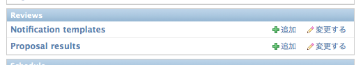

==================================================
トークプロポーザルのレビューシステム
==================================================

PyCon JP サイトでは、提出されたプロポーザルのレビューをシステム上で行うことができます。このマニュアルでは以下の操作について解説します。

.. contents::
   :local:

プロポーザル一覧へのアクセス
===================================================================
まずダッシュボードを開いてください。

.. figure:: site-dashboard.*

ダッシュボードの真ん中あたりに「審査」のセクションがあるはずです。ポスターのレビュー権限など複数のレビュー対象が表示される場合もあります。
このマニュアルでは **Talks** を選んで進みます。プロポーザルの一覧が表示されるはずです。

.. figure:: review-section.*

プロポーザル一覧画面
===================================================================
一覧画面では、それぞれのプロポーザルに関して以下の基本情報を確認できます。

- スピーカー
- タイトル
- カテゴリ
- 投票状況
- 審査ステータス

.. figure:: proposal-list.*

各プロポーザルの詳細確認/投票に進むには、スピーカー/タイトルのリンクをクリックしてください。

レビューをする
===================================================================
プロポーザル詳細は３つのタブから成り立っています。

.. figure:: three-tabs.*

まずは **Proposal Details** タブで、プロポーザルの内容を確認してください。内容を把握したら、投票・コメントに進みます。 **Reviews** タブを開きます。

.. figure:: voting.*

まずは投票を行ってください。各項目の意味は以下です。

- +1 非常に良いプロポーザルで、セッションとして含まれるべきだと思う。
- +0 まあまあのプロポーザル。特にこだわりはない。
- -0 あまり良いプロポーザルではないが、含まれても良いと思う。
- -1 問題があるプロポーザルで、含まれるべきではないと思う。

投票の下にある **COMMENT** 欄に、投票の理由をより詳しく入力してください。Markdown記法が使えますのでご活用ください。

最後に **Submit Review** ボタンを押して完了です。Detailsページに遷移します。

フィードバックを送る
===================================================================
プロポーザルの著者に対してフィードバックを送る機能もあります。内容の確認などに活用ください。Speaker Feedbackタブからアクセス可能です。

.. figure:: proposal-feedback.*

**Send Message** ボタンを押すと、システムに登録された著者のメールアドレスにメールが飛びます。
メールには返信用のリンクがあり、このサイトを通してメッセージの確認・交換をすることができるようになっています。

結果を確定する（審査ステータスを設定する）
===================================================================
投票がある程度集まったら、次は当選・落選の確定に移ります。当選・確定ステータスの変更は、各プロポーザルの詳細画面から行うことができます。

.. figure:: proposal-decision.*

ステータスは後から変更することも出来るようになっています。間違って変えることのないように気をつけてください。

結果を通知する
===================================================================
プロポーザルの当選・落選について、提案者にメールで通知することができます。プロポーザル一覧または詳細画面の左側にあるナビゲーションバーから、TALKSの **結果通知** に進むと、以下のような画面が出ます。

.. figure:: proposal-notification.*

結果通知画面は「Accepted」「Rejected」「Standby」のそれぞれに分かれており、ステータスごとに当選・落選通知を送れるようになっています。なお、前のセクションで解説した「審査ステータス」が Undecidedのプロポーザルに関しては通知は送信できませんのでお気をつけください。

email送信作業をスムーズに進めるため、email テンプレートの活用をおすすめします。

もし必要なテンプレートがまだない場合は、管理画面で作成することが可能です。画面右上の「管理画面」をクリックし、管理画面をひらいてください（レビュー権限ではなく、管理権限が必要です）。

画面の真ん中より少し下に上記のような「Reviews」セクションがあります。「Notification templates」の「＋追加」をクリックし、必要な情報を入れていきます。

.. figure:: proposal-mail-template.png

- Label - テンプレートの名前です。テンプレート一覧に表示されます。
- Body - メールの中身です。以下の変数を使って、プロポーザルごとに異なる部分を反映させることができます。一括送信の際に便利です。

- ``{{ proposal.speaker }}``
- ``{{ proposal.speakers }}``
- ``{{ proposal.title }}``
- ``{{ proposal.kind }} (talk, posterなど)``

テンプレートができたら「結果通知」画面に戻り、作成したものを選択します。通知を送信したいプロポーザルにチェックを入れてから「Next&gt;」ボタンを押してください。

.. figure:: proposal-notification2.*

送信前の確認画面です。内容を確認したら、画面下部の「Send Email」をクリックして終了です。

.. figure:: proposal-notification3.*

お疲れさまでした！

