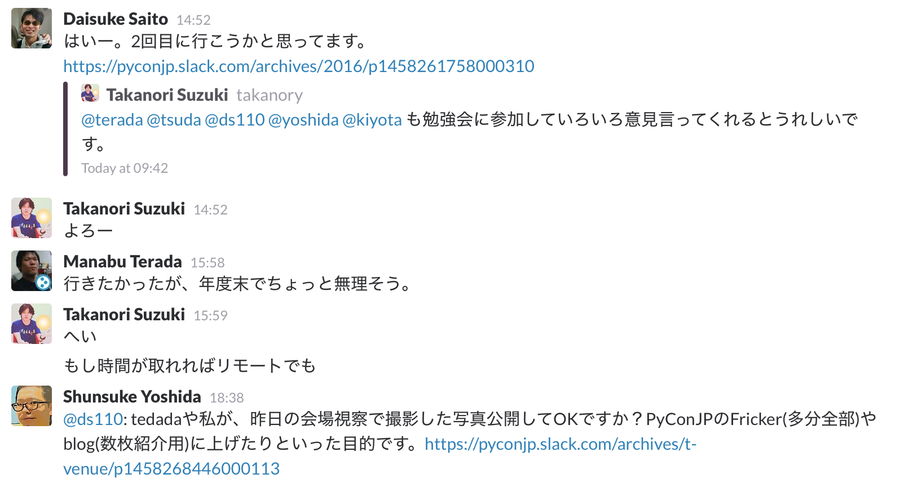
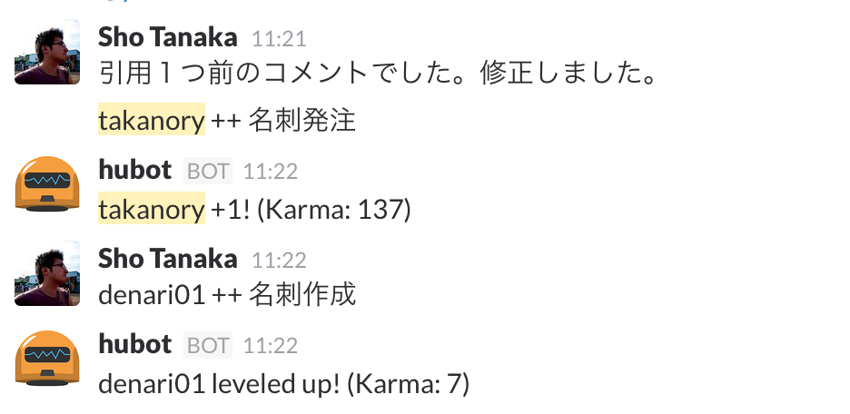

.. _communication:

====================
 コミュニケーション
====================
ここではスタッフ間のコミュニケーションをより円滑にするために気に留めておいてほしいことを書きます。

顔と名前の一致
==============
スタッフは基本的にリモートで作業をすることが多く、実際に顔を合わせる機会はそんなにありません。

しかし、PyCon JP イベント当日は協力してさまざまな作業を行う必要が有るため、顔と名前が一致しており、お互いが認識できることは大事なことです(当日は名札もしていますが、いちいち名札を確認するのは非効率です)。

そのため、スタッフ間で顔と名前をスムーズに一致させるために、以下のお願いをしています。

- Slack のアイコンを顔がわかるものにする
- Slack の username を自分が呼ばれたい名前にする

   Slackのアイコンが顔でわかりやすい

これは、絶対に守らないといけないルールではありませんが、PyCon JP の Slack はクローズドなチャットなので、協力をお願いしています。

.. tip::

   アイコン画像、username などのプロフィールは下記URLから変更できます。

   https://pyconjp.slack.com/account/settings

好ましくない状況
----------------
好ましくない状況としては以下の様なパターンが考えられます。

- 顔がわからないアイコンであり、実作業などにもあまり顔を出さないため顔がわからない

  - 顔がわからないアイコンを使用する場合は、自身の顔をみんなに覚えてもらう努力をしてください

- Slack の username がなんと発音すればよいかわからない

  - 読み方をみんなに伝えてください

- Slack の username はハンドルだが、実際に自己紹介するときは実名を名乗る

  - どちらかに統一してください

謝罪より感謝
============
チーム作業なのでお互いに助け合いが必要です。
メンバーに助けてもらった時は謝るのではなくて感謝の気持ちを伝えましょう。

- Bad: 「XXXXしてもらってすいません」
- Good: 「XXXXしてくれてありがとう」

また、 ``<Slack id>++`` と Slack で発言して感謝の気持ちを伝えると bot がカウントしてくれます。

   ++ 発言のイメージ

黙っている人は存在しない人
==========================
スタッフは全員本業がある傍ら、イベントに関する作業を行っています。
また基本的なコミュニケーション手段はSlack(チャット)とJIRA(課題管理)です。

「どう発言したらいいかわからない」と思うかも知れませんが、発言やアクションを起こしてくれないとその人は **存在しない人** と同じことになってしまいます。

経験のあるスタッフや座長/副座長を中心に、慣れていないスタッフが声をかけてくれたりもしますが、あまり期待しないでください。

自分がやりたいことや貢献したいこと、素朴な疑問、なにをしたらいいかわからない、なんでもいいので発言してください。ほかの人はあなたが、忙しいから発言しないのか、やる気が無いのかはわかりません。

気後れせずどんどん発言しましょう。

また、経験のあるスタッフは自分が逆の立場(初めて参加した)だったら、どうしてくれたら入りやすいかを考えて行動しましょう。

JIRAでのコミュニケーション
==========================
作業の内容は基本的にJIRA(課題管理)にチケットを作成して進めます。

チケットの担当者がタスクを進めます。

不明点があって自分では進められない場合は、 **抱えずに** チケットの報告者(作成者)にタスクを返してください。

質問に回答してほしい時などは、 **担当者を変更する** ようにしてください。

課題を見てもらいたい人にはコメントや課題で@ユーザ名を補完してメンションを飛ばすことができます。

また、JIRAで反応がない場合は、slackでメンションを飛ばすのもお勧めです。

また、自分が気になる課題の更新通知を受け取りたい場合は、課題をウォッチします。

タスクが完了したと思ったら、自分ではCloseせずに課題の解決をし、チケットの **作成者にタスクを返して** ください。

詳細な手順は :ref:`create-issue` を参照してください。

HRT: 謙虚、尊敬、信頼
=====================
`Team Geek <https://www.oreilly.co.jp/books/9784873116303/>`_ より。

- 謙虚（Humility）

  世界の中心は君ではない。君は全知全能ではないし、絶対に正しいわけでもない。常に自分を改善していこう。

- 尊敬（Respect）

  一緒に働く人のことを心から思いやろう。相手を1人の人間として扱い、その能力や功績や高く評価しよう。

- 信頼（Trust）

  自分以外の人は有能であり、正しいことをすると信じよう。そうすれば、仕事を任せることができる。
