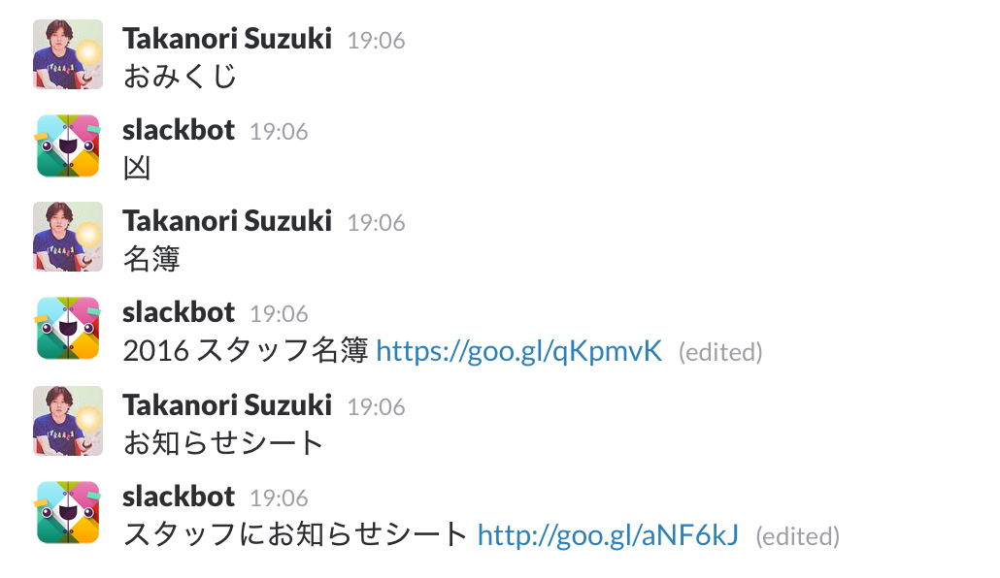
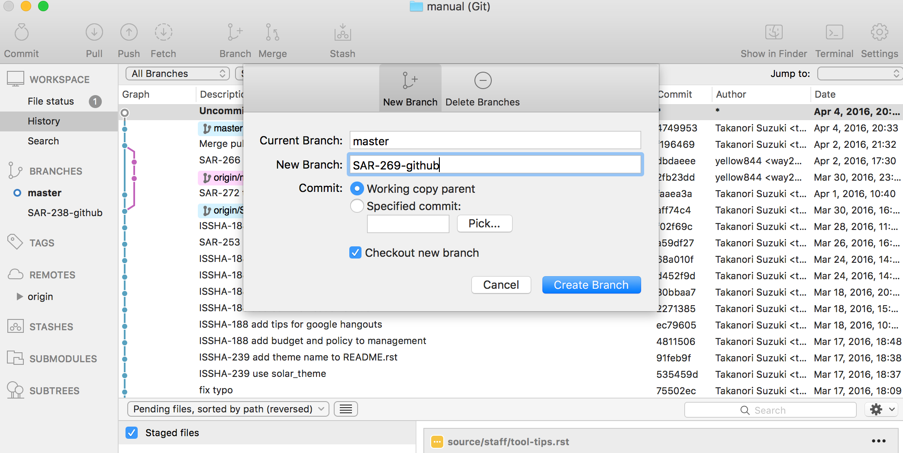
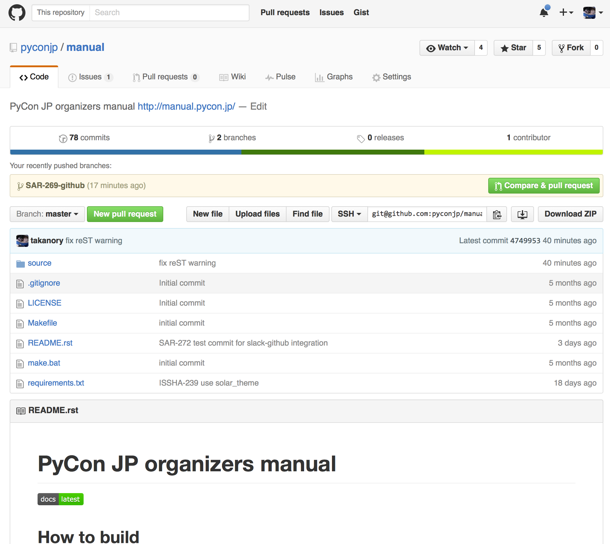
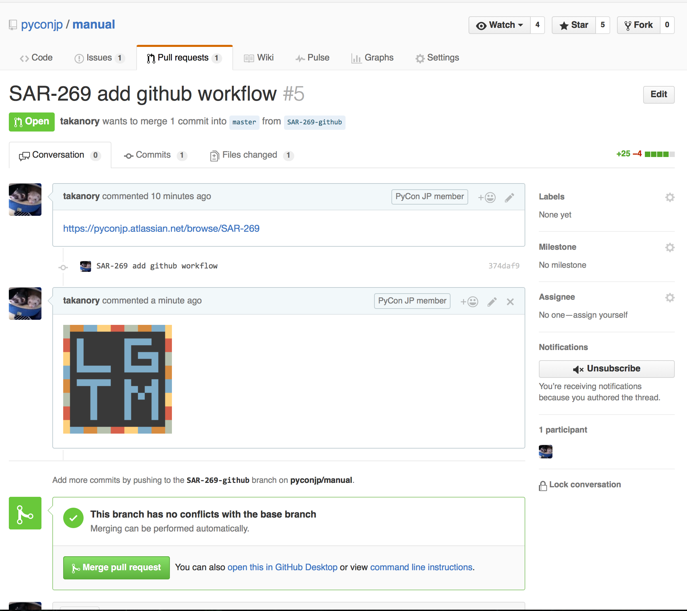

.. _tool-tips:

====================
 ツールの使いこなし
====================

ここではスタッフ作業でよく使うツールの使い方について説明します。

.. index:: slack
           
Slack(チャット)
===============
- URL: http://pyconjp.slack.com/
- ヘルプページ(英語) https://pyconjp.slack.com/help
- メンバー間、各チームでの相談用のチャットです。ログは最新10,000件しか残らないので、記録したい情報はJIRA(課題管理)ツールを使用してください。

チャンネルについて
------------------
PyCon JPのSlackでは主に以下の様なチャンネル(channel、チャットルーム)を使用しています。それぞれのチャンネルの使い分けについて書きます。

- ``#2016``: PyCon JP 2016の全スタッフがいるチャンネルです。スタッフ全員に知ってほしい話や、チームをまたぐとき話をするときに使います。
- **チーム別チャンネル**: チームごとのチャンネルはチームに閉じた話をするときに使います。

  - ``#t-jimukyoku``: 事務局チーム
  - ``#t-media``: メディアチーム
  - ``#t-program``: プログラムチーム
  - ``#t-venue``: 会場チーム

- ``#committee``: 一般社団法人PyCon JPの話をしているチャンネルです。
- ``#general``: PyCon JP Slackに参加する全員が入っているチャンネルです。主には通知用に使っています。
- **通知用チャンネル**: 各種外部ツールからの通知要のチャンネルです。通知を見たい場合に参加してください。

  - ``#notify-calendar``: PyCon JP の Google カレンダー(カレンダー ID: bsn2855fnbngs1itml66l28ml8@group.calendar.google.com)のイベントを通知します。
  - ``#notify-github``: GitHub の `PyCon JP <https://github.com/pyconjp/>`_ でのコミット、Pull Requestなどを通知します。
  - ``#notify-jira``: `JIRA <http://pyconjp.atlassian.net/>`_ のチケット更新を通知します。
- ``#random``: 雑談用のチャンネルです。「おみくじ」など自由に使って下さい。
- **その他チャンネル**: その他、用途に応じたチャンネルがあります。例えば ``#sponsor`` はスポンサー担当、 ``#design`` はデザインに関する話などをしています。

.. tip::

   チャンネルへの参加、離脱は自由ですが、自分が所属するチームと ``#2016`` には参加するようにしてください。

.. warning::

   自分が所属していないチームの話をしたい時には ``#2016`` を使用して下さい。
   「他チームのチャンネルに入って発言する」ということは、基本的にやめてください。

   理由は「チームをまたぐ話はスタッフ全員が見えるところでしてほしい」からです。

Slackの基本的な使い方
---------------------
- `Download Apps <https://slack.com/downloads>`_ でMac、Windows、iOS、Androidなどのアプリが提供されています。使いやすいのでぜひインストールしてください。
- 参加するチャットルーム(channel)の管理(`Browsing and joining channels <https://get.slack.help/hc/en-us/articles/205239967-Browsing-and-joining-channels>`_ 、 `Leaving a channel <https://get.slack.help/hc/en-us/articles/201375146-Leaving-a-channel>`_)

  - channelに参加するには、参加したい channel をクリックして **Join Channel** をクリックします。
  - channelを抜けるには、channel名の横をクリックしてメニューから **Leave channel** を選びます。再度参加することも可能です。
  - 優先して参照したいchannelは、channel名横の **☆** をチェックすると上の方に表示されます。

- 通知(mention)(`Using @mentions <https://get.slack.help/hc/en-us/articles/205240127-Using-mentions>`_ 、 `Making announcements <https://get.slack.help/hc/en-us/articles/202009646-Making-announcements>`_)

  - メッセージに ``@ユーザー名`` と入力とその人にmention(通知)が飛びます。回答がほしいときなどはmentionを使用してください。
  - ``@here`` と入力すると、その部屋にいる現在アクティブな人に通知が飛びます。誰かに相談したいときなどに使うと便利です。
  - ``@channel`` と入力すると、その部屋にいる全員に通知が飛びます。
  - 発言の中に名前だけを入れたい場合は、 ``@`` をつけないで名前だけを書きましょう。(例: XXの件は takanory がやってくれたみたい→報告なのでmentionしない)

- メッセージのフォーマット(`Formatting your messages <https://get.slack.help/hc/en-us/articles/202288908-Formatting-your-messages>`_)

  - ``*アスタリスクで囲む*`` と **太字**
  - ``_アンダースコアで囲む_`` と *イタリック*
  - 最初に ``>`` をつけるとインデントされたテキスト(blockquote)
  - バッククォート(`````)で囲むと ``固定幅のフォント``
  - 3つのバッククォート(```````)で囲むと ``複数行で固定幅フォント``

- メッセージの編集と削除(`Editing or deleting messages <https://get.slack.help/hc/en-us/articles/202395258-Editing-or-deleting-messages>`_)

  - 自分が入力したメッセージをあとから編集、削除できます。
  - 直前のメッセージを編集、削除する場合はカーソルの ``↑`` を入力します。
  - 過去のメッセージの場合は、メッセージの上にカーソルを持っていくとメニューが表示されるので、そこをクリックして編集、削除ができます。

- Slackの使いこなしについては `Using Slack – Slack Help Center <https://get.slack.help/hc/en-us/categories/200111606-Using-Slack>`_ にいろいろヘルプがあるので参照してください。

.. tip::

   複数人でも、明確に回答してほしい人がいる場合は ``@channel`` ではなく名前を指定すべきです。 ``@channel`` のメンションは「自分ではない誰か」にあてたものと思われやすく、名前を指定してあれば「自分にあてたメンションである」ことがわかります。

   - 例: ``@takanory @terada @yoshida XXXXX について回答ください``

   また、誰にメンションしていいかわからない場合は、そのチーム担当副座長にメンションして適切な人を教えてもらいましょう。該当するチームがわからない場合は座長や詳しそうな人にメンションを送るとよいです。
   
さらなる使いこなし
------------------
- スター(`Using stars <https://get.slack.help/hc/en-us/articles/201331016-Using-stars>`_)

  - 発言にスターを付けて「お気に入り」に設定できます→あとで見るとかができます。
  - channel にもスターを付けて「お気に入り」に設定できます→チャンネル一覧で上の方に表示されます。
  - スターをつけた項目は、アプリ右上の **☆** をクリックすると参照できます。

- ``/`` コマンド(`Using slash commands <https://get.slack.help/hc/en-us/articles/201259356-Slash-Commands>`_)

  - ``/invite @user`` 指定したユーザーを channel に招待する
  - ``/msg user [message]`` ユーザーにダイレクトメッセージを送る
  - ``/shortcuts`` キーボードショートカットを表示する

- ``/remind`` コマンド(`Setting reminders <https://get.slack.help/hc/en-us/articles/208423427-Setting-reminders>`_)

  - 日時とメッセージを指定すると、指定時刻に slackbot がメッセージを自分に送信してくれるので非常に便利です。
  - ``/remind help`` remind コマンドの使い方を表示します。
  - ``/reming list`` 現在登録している remind の一覧を表示します。削除もできます。
  - ``/remind me to [message] at [time]`` time 時刻に message が自分に送信されます。

.. tip::

   /remind コマンドの例::
   
     /remind me to drink water at 3pm every day
     /remind me on June 1st to wish Linda happy birthday
     /remind #team-alpha to update the project status every Monday at 9am
     /remind @jessica about the interview in 3 hours
     /remind @peter tomorrow "Please review the office seating plan"

- Slackbot(`Slackbot: your assistant, notepad & programmable bot <https://get.slack.help/hc/en-us/articles/202026038-Slackbot-your-assistant-notepad-programmable-bot>`_)

  - Slackにはカスタマイズ可能なbotが最初から存在します。
  - キーワードに反応して応答を返すbotは簡単に作成できます。PyCon JPではよく参照するドキュメントのURLを登録しています。
  - 下記URLに自由にキーワードを追加して、より便利に使ってください。
  - http://redmine.fudosan-king.jp/projects/pj/issues
    


   Slackbotとのやりとりの例

.. index:: JIRA
   
JIRA(課題管理)
==============
- URL: http://pyconjp.atlassian.net/
- PyCon JP の作業タスク(課題、チケットとも呼ぶ)の管理をするためのツールです。

ダッシュボード
--------------
JIRAの `ダッシュボード画面 <https://pyconjp.atlassian.net/secure/Dashboard.jspa>`_ にはいろいろな情報が表示されています。以下、主な項目です。

課題の統計: 期限切れ(担当者)
  期限きれの課題の担当者別の一覧です。期限が切れている課題は早めに対応するか、期限の変更などを行いましょう。
作成済み vs 解決済みグラフ: PyCon JP 2016
  課題の累積での作成/解決状況を表しています。
JIRA Road Map 今後120日間
  ロードマップ単位のチケットの状況を示しています。
課題の統計
  現在オープン状態の課題のコンポーネント(チーム)別、担当者別の一覧です。
自分の担当課題
  自分がアサインされている課題の一覧です。期限を確認して進めてください。
フィルターの結果: クローズ待ち
  解決済でクローズ待ち状態の課題です。内容を確認して問題なければクローズし、残件などがあれば再オープンしてください。
アクティビティ ストリーム
  最近の更新などがここに表示されます。

課題の検索とフィルター
----------------------
課題メニューの「課題の検索」を選択すると任意の課題が検索できます。
プロジェクト、ステータス、担当者などで絞込ができます。

- `課題ナビゲーター - pycon.jp <https://pyconjp.atlassian.net/issues/?jql=>`_

検索条件はフィルターとして保存、再利用も可能です。
フィルターをお気に入りに設定すると課題メニューに表示されるので便利です。

課題の基本的な処理の流れ
------------------------
課題は以下の様な処理の流れです。

1. 課題(チケット)を作成して、担当者をアサインします。自身が **作成者** となります。
2. 担当者は **処理開始** をクリックして、作業を開始します。また、作業内容をコメントに残してください。
3. 担当者は作業を完了したら **課題の解決** を押します。その際、担当者を **作成者** に変更して、確認してもらってください(自分ではクローズしない)
4. 作成者は内容を確認し、問題がなければ **課題のクローズ** ボタンをクリックして課題(チケット)を閉じます。残件などがある場合はコメントを記述して **課題を再オープンする** をクリックし、担当者を戻します。

.. figure:: images/jira-workflow.png
   :alt: JIRAの課題ワークフロー
   :width: 600

   JIRAの課題ワークフロー

.. _create-issue:

課題の作成
----------
- ログイン後の画面上部にある **作成** ボタンをクリックして課題を作成します。

   .. figure:: images/jira3.png
      :alt: 課題の「作成」ボタン
      :width: 600

      課題の「作成」ボタン

- **課題の作成** 画面で下記の項目を入力し、「作成」ボタンをクリックして課題を作成します。

  :プロジェクト: ``PyCon JP 2016(SAR)`` を選択します
  :要約: 課題のタイトルをわかりやすく書きます
  :優先度: 大事な課題の場合、優先度を上げます
  :期限: 課題を終了する期限を設定します
  :コンポーネント: 担当チームを指定します
  :修正バージョン: 「年内」、「3月末」等目標となる時期を指定します
  :担当者: 担当者がいれば指定します(「自動」の場合チーム担当の副座長が指定されます)
  :説明: 詳細な課題の内容。終了条件をわかりやすく書いてください

.. _issue-template:

JIRAチケットの課題作成テンプレート::

   h2. 目的、達成条件

   - このチケットの目的(ゴール)

   h2. 内容

   - やってほしいことを
   - 箇条書きなどで書く
   - 着手したら *処理開始* をクリックし、作業内容をコメントに残す
   - 作業を完了したら課題解決して担当者を *作成者* に変更

ここで気をつけてほしいことは、「説明」の欄に「なにをするか」ではなくて **作業の目的はなにか** 、 **目的を満たすゴール** を明確に書くということです。

「なにをするか」だけが書かれたチケットは、他の人がチケットを受け取った時に「どこまで実施すれば完了か」がわからず、必要以上の労力を使うことがよくあります。

また、人は忘れる生き物なので、自分が作成したチケットでも目的やゴールを忘れます。
そうならないために、チケットの目的とゴールを明確にしてください。

上記のように「目的」と「内容」を分けて書くのがおすすめです。

.. _edit-issue:

課題の編集
----------
タスクを進める場合には、主に以下の様な操作を行います。

- **処理開始** ボタンをクリックして、課題に着手します
- **コメント** を記入して状況を記入します
- **割り当て** ボタンをクリックして担当者を変更します
- **課題の解決** ボタンをクリックして、課題を解決状態にします。その際は担当者を報告者と同じ人にしてください(報告者に確認して課題をクローズしてもらうため)
- **その他** メニューから「リンク」を選ぶと、関連する課題とのリンクが貼れます。他に「ファイル添付」や「サブタスクの作成」などもできます

なお、優先度、修正バージョン、コンポーネント、ラベル、期限などもクリックして編集が可能です(マウスオーバーすると鉛筆アイコンが表示されます)。

課題の検索
----------
画面上部にある **課題** メニューをクリックすると課題を検索できます。
以下のような検索フィルターも用意してあります。

- `[1.事務局チーム] 課題ナビゲーター - pycon.jp <https://pyconjp.atlassian.net/issues/?filter=10301>`_
- `[2.会場チーム] 課題ナビゲーター - pycon.jp <https://pyconjp.atlassian.net/issues/?filter=10302>`_
- `[3.プログラムチーム] 課題ナビゲーター - pycon.jp <https://pyconjp.atlassian.net/issues/?filter=10300>`_
- `[4.メディアチーム] 課題ナビゲーター - pycon.jp <https://pyconjp.atlassian.net/issues/?filter=10303>`_

フィルターを表示した状態で、フィルター名横の ``☆`` をクリックすると、フィルターがお気に入りに入り「課題メニュー」から選択できるようになります。

詳細なチケット処理の流れ(画面イメージつき)
------------------------------------------

1. 自分の担当課題(チケット)を見る

   - JIRA(https://pyconjp.atlassian.net/)のトップページにアクセスし、自分の担当課題を見ます
   - メニューバーの課題の検索からチームごとの課題や、期限切れの課題なども参照できます
   - 新規課題の作成は課題の作成ボタンを教えて下さい
   - 右上のプロファイルメニューから、パスワードなどが設定できます(アバター画像は `Gravatar <http://ja.gravatar.com/>`_ でメールアドレスに対応した画像を設定する必要があります)

   .. figure:: images/jira4.png
      :alt: JIRAダッシュボード
      :width: 600

      JIRAダッシュボード

2. 課題の作成

   - 課題の作成ダイアログが表示されるので、必要な項目を記入して作成ボタンで課題を作成します。このとき担当者にメールで「課題が作成された」ことが通知されます。

   .. figure:: images/jira5.png
      :alt: 課題の作成ダイアログ
      :width: 500

      課題の作成ダイアログ

   - 作成された課題を表示すると、例えば以下の様な表示になります。

   .. figure:: images/jira6.png
      :alt: 作成された課題
      :width: 600

      作成された課題

3. 課題の処理開始

   - 課題の担当者はステータスがオープンの課題の処理開始ボタンを押します。こうすることによって「自分はこの課題の作業を始める」という意思を表明します。

   .. figure:: images/jira7.png
      :alt: 「処理開始」ボタンをクリック
      :width: 600
              
      「処理開始」ボタンをクリック

   - ステータスは「進行中」に変わります

   .. figure:: images/jira8.png
      :alt: ステータスが「進行中」
      :width: 400

      ステータスが「進行中」


4. 課題にコメント

   - 課題に対して実施した内容をコメントとして残します。
   - コメントはこんな感じで書くと(参考: `テキスト書式の表記に関するヘルプ <https://pyconjp.atlassian.net/secure/WikiRendererHelpAction.jspa?section=texteffects>`_)

   .. figure:: images/jira9.png
      :alt: コメントを記入
      :width: 600

      コメントを記入

   - こんな表示になります

   .. figure:: images/jira10.png
      :alt: コメントの入力結果
      :width: 600

      コメントの入力結果


5. 課題を編集

   - 課題の優先度、説明、ラベル、コンポーネント等を編集できます。
   - 値の上にマウスカーソルを持って行き、クリックすると編集ができます。

   .. figure:: images/jira11.png
      :alt: 課題の項目にマウスオーバー
      :width: 600

      課題の項目にマウスオーバー

   - 優先度をクリックするとこんな感じで編集用のリストボックスが開きます。

   .. figure:: images/jira12.png
      :alt: 課題の項目を編集
      :width: 600

      課題の項目を編集

6. 他の課題へのリンク

   - 課題に関連した他の課題がある場合はリンクを設定します。
   - その他メニューのリンクを選択します。

   .. figure:: images/jira13.png
      :alt: 「リンク」メニューを選択
      :width: 600

      「リンク」メニューを選択

   - するとリンクダイアログが開くので、リンクする課題を指定します。
   - リンクの種類は通常はrelates to(関連している)を選択してください。課題が重複している場合はdupulicatesを選択します。

   .. figure:: images/jira14.png
      :alt: リンクする課題を指定
      :width: 600

      リンクする課題を指定

   - リンクを作成すると以下のように課題リンクが表示されるようになります。

   .. figure:: images/jira15.png
      :alt: 課題リンクの表示
      :width: 600

      課題リンクの表示

7. 課題のウォッチ

   - 気になる課題の更新通知を受け取りたい場合は、課題をウォッチします。
   - ピープルのこの課題のウォッチを開始するをクリックします。

   .. figure:: images/jira16.png
      :alt: 課題のウォッチャーに追加
      :width: 600

      課題のウォッチャーに追加

   - また、数字をクリックするとウォッチしている人の一覧が確認できます。
   - なお、他の人をウォッチャーに追加するには管理権限が必要です。

   .. figure:: images/jira17.png
      :alt: ウォッチャーの一覧を参照
      :width: 400

      ウォッチャーの一覧を参照

8. 担当者の変更

   - チケットの処理をする人を変更する場合には割り当てをクリックして、担当者を変更するためのダイアログを開きます。
   - 質問に回答してほしい時なども、担当者を変更するようにしてください。

   .. figure:: images/jira18.png
      :alt: 「割り当て」ボタンをクリック
      :width: 600

      「割り当て」ボタンをクリック

   - 割り当てダイアログでは担当者を指定して、コメントを書きます。
   - コメントには、担当者に実施してほしいことを具体的に書いてください。

   .. figure:: images/jira19.png
      :alt: 担当者を指定
      :width: 600

      担当者を指定

9. 課題の解決

   - チケットの内容が完了したら課題の解決をクリックして、ダイアログを開きます。

   .. figure:: images/jira20.png
      :alt: 「課題の解決」をクリック
      :width: 600

      「課題の解決」をクリック


   - 課題の解決ダイアログでは解決状況(基本は修正済み)を選択し、担当者を報告者に変更して状況についてのコメントを記入してください。

   .. figure:: images/jira21.png
      :alt: 「課題の解決」ダイアログ
      :width: 600

      「課題の解決」ダイアログ

10. 課題のクローズ

    - 課題の作成者は、解決された内容が問題なければ課題のクローズをクリックして、ダイアログを表示します。
    - もし問題がある場合は、その右の課題を再オープンするをクリックして、元の担当者に差し戻します。

    .. figure:: images/jira22.png
       :alt: 「課題のクローズ」をクリック
       :width: 600

       「課題のクローズ」をクリック

    - 課題のクローズダイアログではコメントを書いて課題を閉じます。

    .. figure:: images/jira23.png
       :alt: 「課題のクローズ」にコメントを記入
       :width: 600

       「課題のクローズ」にコメントを記入

    - 課題のステータスがクローズになって終了です。
     
    .. figure:: images/jira24.png
       :alt: 課題のステータスが「クローズ」
       :width: 600

       課題のステータスが「クローズ」

.. index:: Googleドライブ
           
Googleドライブ(ファイル共有)
============================
- URL: https://drive.google.com/
- チーム内でのファイル共有にはGoogleドライブを使用しています。

基本的な使い方
--------------
共有
~~~~
- PyCon JP フォルダ以下は全 PyCon JP スタッフに共有されています。
- 新規にドキュメントやスプレッドシートを作成する場合は、任意のフォルダ以下に配置するようにしてください。(例: PyCon JP/2016/1.事務局)
- フォルダに配置したドキュメントなどは、自動的に PyCon JP スタッフに共有されるため、個別に共有設定などをしなくていいので便利です。

移動
~~~~
- ドキュメントなどを任意のフォルダに移動するには、ドキュメントの上で右クリックして「移動」を選ぶか、ドラッグ&ドロップで移動します。

Google ドキュメント
-------------------
- 議事録には Google ドキュメントを使用すると便利です。
- あらかじめ議事録の議題(アジェンダ)のみを書いておいたドキュメントを用意し、事前にコメントをもらうと、効率的に会議が進められます(参加できない人もコメントできる)。
- また、Googleドキュメントは複数人で同時に編集ができるので、発言したいことがある場合は先に記入しておくとスムーズに会議が進んだりします。
- 会議が終わった瞬間に議事録ができあがっているので、効率的です。

.. note::
   
   さらにTODO項目に関してJIRAチケット作成まで終わっていると、よりよいです。

Google スプレッドシート
-----------------------
- 一覧表のようなものやアンケートにはスプレッドシートを使用すると便利です。
- スプレッドシートを見やすくするために、フィルタや条件付き書式なども使うとより便利になります。
- また、投票を募るような場合にはスプレッドシートと Google フォームを組み合わせるとさらに便利になります。

.. tip::
   
   `Apps Script <https://developers.google.com/apps-script/>`_ を使用すると、スプレッドシートをデータベースみたいに使って、いろいろと便利なことができます。

   PyCon JP 2016 ではスプレッドシートとApps Scriptの組み合わせで、Slackに通知する機能や、Twitter/Facebookに告知する機能を提供しています。

   - 参考: :doc:`/appendix/templates`

.. index:: Googleハングアウト, ハングアウト

Googleハングアウト(ビデオ会議)
==============================
- URL: https://hangouts.google.com/
- リモートでの音声ミーティングにはGoogleハングアウトを主に使用しています。
- 他の手段としてSkype、SlackのCall機能などがありますが、以下の理由で最近はハングアウトの利用が増えているようです。

  - Skype のように事前にアカウントの共有が不要
  - 複数人で会話できる(Slack Callは無料プランだと1対1のみ)

ハングアウトをはじめる
----------------------
1. 最初に、Googleハングアウト(https://hangouts.google.com/)の画面をChromeで開き、 **ビデオハングアウト** をクリックします。

   .. figure:: images/hangouts1.png
      :alt: Googleハングアウト
      :width: 500

      Googleハングアウト

2. 次に適当な名前を入力して、 **→** をクリックしてハングアウトを開始します。

   .. figure:: images/hangouts2.png
      :alt: ハングアウト名を入力
      :width: 500

      ハングアウト名を入力

3. 画面中央にハングアウトのパーマリンクが表示されるので、このURLをSlackなどで共有します。また、画面左側のメニューに「画面共有」があるので、リモートの人と同じ画面を見ながら会議を進める場合には便利なので活用してください。

   .. figure:: images/hangouts3.png
      :alt: リンクを共有
      :width: 500

      リンクを共有

.. index:: Git, GitHub

Git/GitHub
==========
PyCon JPではこのマニュアルや開発しているソースコードのバージョン管理に `GitHub <https://github.com/>`_ を使用しています。
普段、開発などを行わない人向けに、基本的な使い方を書きます。

PyCon JP では https://github.com/pyconjp/ という Organization でコードを管理しています。この Organization は PyCon JP スタッフだ誰でもリポジトリの追加、書き込みが可能です。

GitHubを使う目的
----------------
Git/GitHubを使う目的は、ドキュメントやプログラム開発の効率化のためです。
なにか失敗したときに元に戻したり、複数の人が協力してコードを書いたりするのが便利です。

ツールの紹介
------------
Git はコマンドラインで実行できますが、GUIのツールを使ったほうが最初は楽です。
GitHubに対応したツールは以下のものがあります。

- `SourceTree <https://www.sourcetreeapp.com/>`_
- `GitHub Desktop <https://desktop.github.com/>`_
  
基本的な処理の流れ
------------------
基本的な処理の流れは以下の様な手順です。

- 軽めの変更で直接コミットする場合

  1. JIRA課題を作成します
  2. リポジトリをクローンします
  3. コードやドキュメントを書いてcommitします。commitメッセージにはJIRA課題のID(SAR-XXX等)を入れます
  4. 完了したらJIRAの課題をクローズします

- 大きめの変更でレビューをしてほしい場合
  
  1. JIRA課題を作成します
  2. リポジトリをクローンします
  3. ブランチを作成します。ブランチ名にはJIRA課題のID(SAR-XXX等)を含めます
  4. コードやドキュメントを書いてcommitします。commitメッセージにはJIRA課題のID(SAR-XXX等)を入れます
  5. Pull Requstを作成します
  6. JIRA課題を「解決」し担当者を変更して、レビュー依頼をします
  7. レビュワーはレビューしてOKだったらマージします
  8. JIRA課題をクローズします

詳細な処理の流れ
----------------
上記の処理の流れでレビューありのパターンを詳細に説明します。

.. note::

   画面例は SourceTree です

1. JIRA課題を作成
~~~~~~~~~~~~~~~~~
- 変更の対象となるJIRAの課題を作成します。
- 詳細な手順は :ref:`create-issue` を参照してください。

2. リポジトリをクローン
~~~~~~~~~~~~~~~~~~~~~~~
ｰ SourceTree などを立ち上げて、リポジトリをクローンします。
- リポジトリのURLが github のページにあるので、その URL を指定してクローンします。
   
3. ブランチを作成
~~~~~~~~~~~~~~~~~
- **Branch** をクリック
- **New Branch** にブランチ名を入力して **Create Branch** をクリック

  - ブランチ名にはチケット番号を入れます



   ブランチを作成

4. コードをコミット
~~~~~~~~~~~~~~~~~~~
- 左上の **Commit** をクリック
- コミットメッセージを入力して **Commit** をクリック

  - コミットメッセージにチケット番号を入れます
  - 左下のチェックボックスをクリックすると、Commit と同時にサーバーに Push します

5. Pull Requstを作成
~~~~~~~~~~~~~~~~~~~~
- 編集が完了したら、レビュー依頼するために Pull Request を作成します
- github のリポジトリのページを開いて、自分が作成したブランチを default にマージするための Pull Request を作成します

  - 下記の画面の場合は **Compare & pull request** をクリックします

- 次の画面で Create pull request を作成します



   Pull Requestを作成

6. JIRA課題でレビュー依頼
~~~~~~~~~~~~~~~~~~~~~~~~~
- JIRA課題を編集し、担当者をレビュワーに変更してレビューを依頼をします

  - チケットのコメントに Pull request の URL を記入してください
- 編集方法は :ref:`edit-issue` を参照してください

7. レビューしてマージ
~~~~~~~~~~~~~~~~~~~~~
- レビュワーは内容が問題なければ、Pull request 上で **Merge pull request** をクリックしてマージします



   Pull Requestをマージ

8. JIRA課題をクローズ
~~~~~~~~~~~~~~~~~~~~~
- レビュワーは課題をクローズして終了です。
