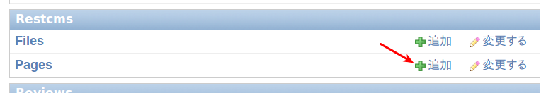
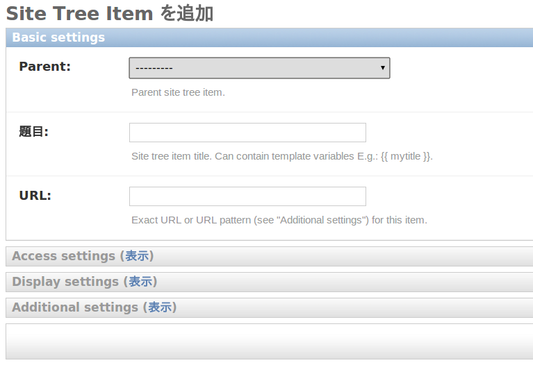
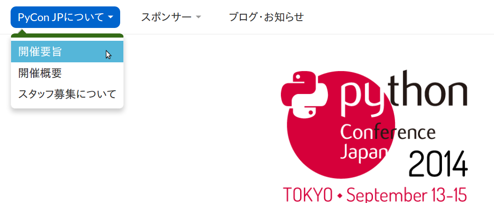
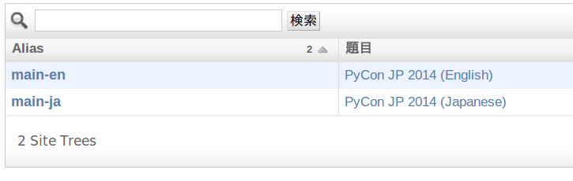
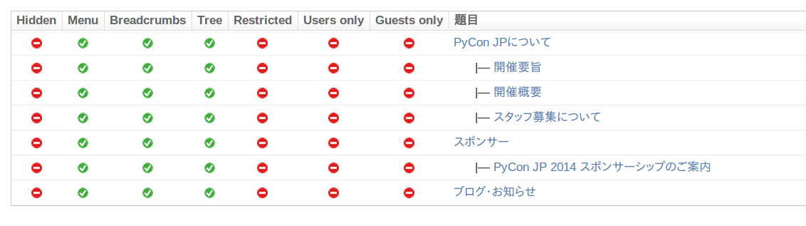
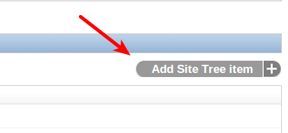
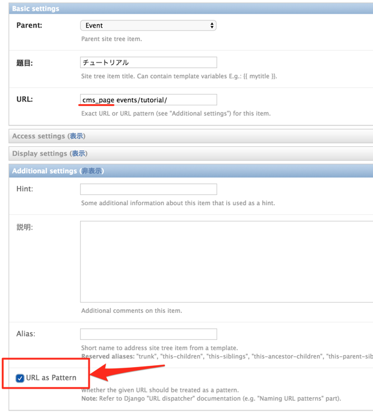

================
コンテンツページ
================

コンテンツページとは？
======================
コンテンツページはサイトの上の静的ページのことです。「規約(code of conduct)」とか、「スポンサー募集」とか、「会場案内」とか、「参加する方法」とかはコンテンツページで作られます。

コンテンツページを作成する
==========================
管理画面にログインする必要があります。管理画面のアカウント作成方法・ログインの仕方は「 :ref:`Webサイトへのスタッフ登録 <staff>` 」を参考にしてください。
管理画面にログイン後、「Restcms」セクションの「Pages」の「追加」リンクをクリックする。

以下のようなページが表示されると思います。

`（動画）PyCon JP Web への SiteTree URLの追加方法 <https://youtu.be/Lmkpq3Ir9A8>`_

============ ===============
option       説明
============ ===============
content      ReST でかかれているコンテンツページの内容です。
language     コンテンツの言語です。日本語か英語です。この言語によって、ブラウザがどのコンテンツが表示されるかが判定されます。ブラウザが日本語に設定されている場合は、英語版しかないコンテンツが表示されない(404)のでご注意ください。 
path         コンテンツをアクセスするパス。このパスは http://pycon.jp/{年度}/{path} という形のURLになります。
publish date 公開日時
status       公開ステータスです。「下書き」のコンテンツは外からアクセスできません。
============ ===============

コンテンツページに画像を追加する
--------------------------------

画像を追加するには、管理画面にログインし `「Rest CMS > file」 <https://pycon.jp/2016/ja/admin/restcms/file/>`_ から画像をアップロードしてください。
アップロードするとURLが表示されます。ページの画像を挿入したい位置で

::

    .. image:: /2016/ja/files/5/jessica_profile.jpeg

のように記述すると画像を表示させることが出来ます。

メニューとは？
==============
メニューはサイト上の上のナビゲーションメニューのことです。サイト内のページや、外部ページへのリンクが入っています。

メニューに追加
==============
コンテンツページは作っても、サイトのメニューに追加されないので、追加する必要があります。まず、管理画面の「SiteTrees」のところをアクセスしましょう。

.. figure:: images/contents_sitetree.png
   :alt: コンテンツメニュー

メニュー機能自体は多言語対応していないため、英語用のメニューと、日本語用のメニューがそれぞれ登録されています。 
Site Treesの管理画面へアクセスすると、以下のサイトツリーが出てくると思います。 main-en は英語用、main-ja は日本語用

追加したいメニューをクリックします。以下の画面が出てきます。

メニューはツリー構造になって、そのツリー構造が画面に表示されます。追加するには右側にある「Add Site Tree Item」をクリックします。

追加フォームが出てきます。

以下のコンテンツを入力:

+--------+------------------------------------------------------------------------------------------------------------------------------------+
| 項目   | 説明                                                                                                                               |
+========+====================================================================================================================================+
| Parent | メニューアイテムの親。ルートメニューに追加したい場合はこれは空になります。                                                         |
+--------+------------------------------------------------------------------------------------------------------------------------------------+
| URL    | リンク先のURLになります。                                                                                                          |
|        |                                                                                                                                    |
|        | 1. 外部リンクの場合はこれは絶対URLになります。                                                                                     |
|        | 2. サイト内のコンテンツページの場合                                                                                                |
|        |     * cms_page "<path>" を入力                                                                                                     |
|        |     * 「Additional Settings」に「URL as pattern」にチェックを入れる                                                                |
|        | 3. サイト内のコンテンツページ以外のページの場合は、相対パスを書きます。(/ から始まるパスだと、/2014/ が必要なので、ご注意ください) |
+--------+------------------------------------------------------------------------------------------------------------------------------------+
| 題目   | メニューに出てくるテキスト (例: 「スタッフ募集について」)                                                                          |
+--------+------------------------------------------------------------------------------------------------------------------------------------+

「URL as pattern」は下記画像の位置にあります。

注意点

* それぞれのSite Treeは連動していないので、英語用メニューにリンクを追加しても、日本語用メニューに追加されないので、ご注意ください。
* メニュー追加の場合は、特に管理画面にバリデーションがないので、メニューの動作確認をしてください。
* 「保存してもう一つ追加」ボタンは絶対に使わないでください。使うと、Site Tree一覧や、pycon.jp が自体が表示されなくなるバグがあります(参考: UMA-993)。

