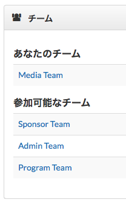
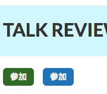
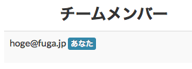

.. _staff:

===========================
 Webサイトへのスタッフ登録
===========================
※本番サイト立ち上げまではステージング環境、立ち上げ後は本番サイトにて行う作業です。

スタッフ登録されると各コンテンツの編集や、権限によりプロポーザルのレビューなどを行うことが可能となります
また、管理サイトより各種設定が可能となります

管理サイトのURLは、以下のとおりです。

* `ステージング環境 <http://staging.pycon.jp/2016/ja/admin>`_ : ステージング環境にはBASIC認証がかけられています。username/passwordはスタッフに確認してください。
* `本番環境 <http://pycon.jp/2016/ja/admin>`_

アカウント作成
==============
まずはWebサイト( `ステージング <http://staging.pycon.jp/2016/ja/account/signup/>`_ 、 `本番 <http://pycon.jp/2016/ja/account/signup/>`_ )よりアカウントを作成してください

スタッフ登録
============
続いてスタッフ権限の付与を行います。
依頼はチームが決まっているのであれば各副座長に `JIRA <https://pyconjp.atlassian.net/>`_ でチケットを作成して依頼してください。
お急ぎの際はSlackでmentionして下さい

副座長が多忙の際は、座長のtakanoryさん、メディアチームのyhashimoto、yoshidaさんなどが対応可能です

チーム登録
==========
サイト ( `ステージング <http://staging.pycon.jp/2016/ja/account/signup/>`_ , `本番 <http://pycon.jp/2016/ja/account/signup/>`_ )に戻り、
ページ右上のリンクからダッシュボードを開きます。

ページ中腹に、「チーム」セクションがあります。参加済のチーム、参加可能なチームのリストが表示されます。

参加したいチームのリンクをクリックすると、参加ボタンが出てきます。

左側の（緑色の！）「参加」ボタンをクリックすると、チーム登録が完了します。チームメンバーの一覧にあなたのアカウントがあることを確認して下さい。

チーム登録作業は以上です！お疲れさまでした。
